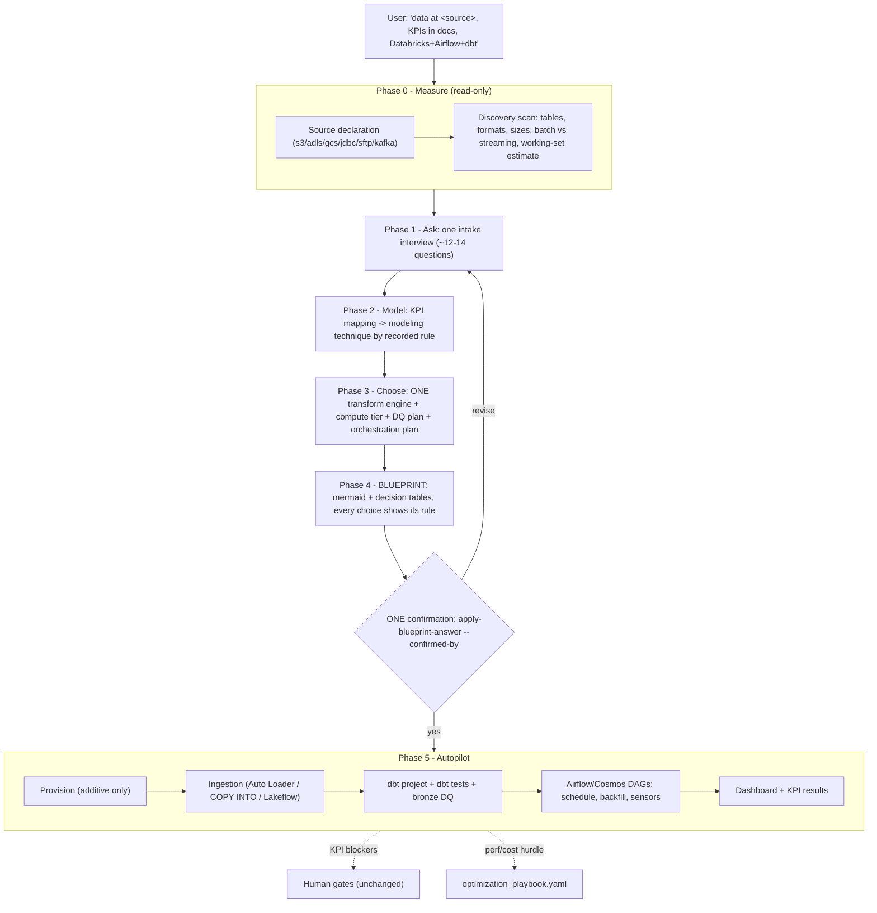

# Cloud-First Restructure — Design Spec

Date: 2026-08-05
Status: Approved in brainstorm; pending user review of this written spec
Branch context: design only — no implementation yet

## 1. Problem

The platform's spine is local-first (local files + DuckDB), with Databricks as a bolt-on
`databricks_source` mode. A real cloud-intent session (user: "our data is at
`arn:aws:s3:::amzn-workspace-rcm`, we use Databricks + Airflow + dbt") failed in three ways:

1. **No S3/external-source intake path.** The user's most important input (the bucket) had
   nowhere to go — no command lands external data into Unity Catalog.
2. **No catalog/schema provisioning.** "Create a new catalog `rcm`" has no supported command;
   the agent improvised un-governed inline SDK calls and repointed at the wrong catalog.
3. **Local-first ceremony fought cloud intent.** `local_files` implicit default, per-stage
   panels/confirmations, readiness checks disagreeing with the Databricks CLI — six
   back-and-forths and a crash before any pipeline existed.

## 2. Decisions (user-confirmed during brainstorm)

| # | Decision | Choice |
|---|---|---|
| D1 | Scope | **Cloud-first; local DuckDB kept as explicit `--local` dev mode** (not deleted) |
| D2 | Ingestion ownership | **Platform owns landing** external data into UC via Databricks-native ingestion; source-agnostic (S3/ADLS/GCS/JDBC/SFTP/Kafka — S3 is one case, not the feature) |
| D3 | Orchestrator | **Airflow (astronomer-cosmos) is THE orchestrator**; dev = astro/docker-compose, prod = customer's Airflow (Astronomer/MWAA/self-hosted) |
| D4 | Safety model | **Gate only destructive ops** (DROP/REPLACE existing, schema deletes, overwrites, grant changes). Additive ops (create catalog/schema/external location, land bronze, dbt run, deploy DAGs) run freely once the workspace is cloud-declared |
| D5 | Engines | **Keep all three (SQL/dbt, PySpark, Polars); ONE production engine per workspace transform DAG**, chosen from measured data + intake answers. Not per-KPI, and not three parallel copies |
| D6 | First-run UX | **Blueprint-first**: discovery → intake interview → rendered pipeline blueprint (mermaid + decision tables, each choice showing the rule that fired) → ONE human confirmation → autopilot to genuine human gates |
| D7 | Migration | **Strangler**: build the new spine alongside the untouched local flow; flip defaults only after the end-to-end rcm replay passes on real Databricks |

## 3. Research base (all in `docs/reference/`)

- `engine_roles_at_scale_research.md` — no industry precedent for 3 hand-written copies of the
  same logic; routing + one-definition patterns; UC credential vending = non-Spark writers
  read-only on managed tables.
- `engine_compute_selection_research.md` — decide by **working set scanned per run**, not
  size-at-rest; published crossovers (<10 GB single-node; 5–50 GiB stable → Polars-eligible;
  ≥100 GB → Spark/warehouse; >1 TB distributed); serverless-first compute (~30-min break-even
  to classic); optimization playbook encoding (symptom → threshold → cheapest-first remedies,
  every rule cited).
- `end_users_data_modeling_research.md` — consumer taxonomy anchored on dbt `exposure.type`;
  14-question intake; hybrid layer map (bronze raw / silver conformed / gold Kimball star +
  OBT projections for hot fixed shapes); liquid clustering ≤4 keys replaces partitioning/ZORDER;
  deterministic hash surrogate keys over identity columns.
- `data_quality_frameworks_research.md` — dbt tests (+dbt-expectations/Elementary) primary;
  Databricks-native expectations (Lakeflow/DQX) at the bronze boundary; do NOT adopt
  GE/Soda/Deequ as an additional framework; profile-derivable checks vs must-ask business rules.
- `pipeline_practices_gap_research.md` — dbt-databricks silent-wrong-data traps, backfill
  primitives, event-trigger traps, WAP-on-Delta, ghost tables, cost attribution via query_tags,
  hashed cron offsets.
- Repo inventory (round 1 explorer): engine generator LOC/shape, parity mechanisms and their
  gaps, `derived_formula` SQL lock-in, dbt generator already reusing SQL generator internals.

## 4. Architecture — the new spine

One governed flow drives Phases 0–4 and stops exactly once:

### Phase contents

- **Phase 0 — Measure.** Source declaration persisted in `workspace_settings.json`
  (connector type, location, credential *reference* — never a secret value). Read-only
  scanners per connector list tables/files, formats, sizes, batch-vs-streaming signals, and
  estimate the working set per run. Everything measurable is measured, never asked.
- **Phase 1 — Ask.** One consolidated panel-based interview (~12–14 questions merged from the
  end-users and engine-selection reports): consumers (dbt exposure types) + decisions driven,
  freshness SLA tied to a named decision, grain sentence, "as it was then?" (SCD2 binary),
  retention, restatement policy, growth step-changes, backfill depth, concurrency, budget /
  serverless-vs-VPC tolerance, non-SQL logic needs, PII/compliance. Answers persist as durable
  workspace facts (asked once, reused everywhere).
- **Phase 2 — Model.** KPI mapping (existing flow) + modeling technique selected via the
  8-rule decision table. Default: conformed star in gold; OBT only as a projection off the
  star for hot fixed-shape dashboards; Data Vault silver only if the regulatory rule fires.
  SCD2 only if Phase 1 said yes.
- **Phase 3 — Choose.** Engine (one for the whole transform DAG), compute tier, DQ plan,
  orchestration plan — all via decision tables (Section 5).
- **Phase 4 — Blueprint.** Rendered to
  `workspaces/<ws>/interns/reports/solution_blueprint/current.md` (+ `.json`): the mermaid
  pipeline graph with the workspace's actual table names, provisioning table (what will be
  created + credential needed), per-KPI dbt model mapping, engine + compute choice with 2
  cost-annotated options, DQ summary, DAG schedule, and an explicit "everything additive"
  line. Re-runs render a diff vs the confirmed version (plan-style). Confirmation =
  `apply-blueprint-answer --confirmed-by "<name>"` (human provenance, per existing rule).
- **Phase 5 — Autopilot.** Provision → ingest → generate dbt + DAGs → run → present results.
  Stops only at KPI blocker panels and destructive-op gates.

### New vs reused

| Piece | Status |
|---|---|
| Source declaration + discovery scanners (`core/intake/`) | New; generalizes `discover-external-sources` seam |
| Intake interview | New; reuses KPI blocker panel machinery |
| Decision engine (`core/blueprint/`) | New; absorbs `engine_recommender.py` |
| Blueprint renderer + diff | New; reuses `prepare-solution-blueprint` / `apply-blueprint-answer` seams |
| Provisioner (additive-only) | New — transcript gap #2 |
| Ingestion generator (per connector type) | New — transcript gap #1 |
| dbt project generator | Reused + hardened (Section 6) |
| Cosmos/Airflow emitter | Reused + extended (Section 8) |
| KPI panels, PHI gates, validators, dashboard | Unchanged |
| Local DuckDB flow | Untouched until flip; then `--local` dev mode |

## 5. Decision engine

Data-driven tables (config/data files, not code branches). Every fired rule recorded as
`(rule_id, evidence, source)` and displayed in the blueprint so a reviewer can attack the
premise.

**Engine (one per workspace transform DAG):**

| Condition (measured working set per run + intake) | Engine |
|---|---|
| < 10 GB, batch, simple joins | Single-node (Polars or DuckDB-SQL) — dev/POC tier |
| 10–50 GB, stable size, modest complexity | Polars eligible; SQL/dbt default |
| ≥ 50–100 GB, or streaming, or heavy joins, or multi-consumer gold | SQL/dbt on warehouse (default overall) |
| Non-SQL logic (UDF-heavy, ML features) or > ~1 TB non-SQL working set | PySpark |

Constraints: ingestion is platform infrastructure (Auto Loader/Lakeflow), outside this choice —
the medallion "bronze is Spark-ingested, gold is dbt" split is standard, not a violation.
Polars is never a production writer to governed UC managed tables (credential vending is
read-only for external writers; masked/filtered tables unsupported) — its production role is
capped at dev-loop, sampled reconciliation, and light non-governed tasks until that changes.
No fabricated sizes: the `rows*cols*16` fallback is deleted; missing measurements become an
intake question, never a guess.

**Compute:** serverless-first (15–30 s start). Classic job clusters when a job exceeds
~30 min, needs custom libraries, or VPC constraints apply. DBSQL warehouse sizing follows the
research's first-party t-shirt tables. Blueprint presents two options with cost notes;
user's single confirmation covers the pick. (Third-party price ratios flagged as re-verify
before quoting.)

**Modeling:** 8-rule table from `end_users_data_modeling_research.md`; default R5
(multi-consumer → conformed star). OBT only as projection; Vault only on the regulatory rule.

**DQ:** severity tiers warn / fail / quarantine. Placement per Section 7.

**When to revisit:** telemetry triggers (data growth crossing a tier threshold, SLA misses,
cost spikes from `system.billing.usage` / query history). Rule: consult the optimization
playbook and tune FIRST; engine change is the last resort and runs as a time-boxed dual-run
reconciliation with a decommission date.

## 6. Generator hardening (emitted-code rules)

The generated dbt project must always satisfy:

1. Never `merge` without `unique_key` (silent append/duplicates otherwise).
2. `on_schema_change` always explicit (`append_new_columns`); never default `ignore`
   (silently drops new columns).
3. `microbatch`/`replace_where`: column-name-safe select ordering enforced (Databricks inserts
   by POSITION, not name); `event_time` declared on upstream parents too (else full-table scan
   per batch); explicit `lookback` for late data.
4. Deterministic hash surrogate keys, not identity columns (reproducible across rebuilds;
   pairs with SCD2 `AUTO CDC ... sequence_by` as the escape for PK-value corrections).
5. Liquid clustering (≤4 keys) on all new tables; no partitioning below ~1 TB.
6. `query_tags` enabled → per-model cost attribution from `system.query_history` for free.
7. Ghost-table reconcile on every regeneration: dbt manifest vs `information_schema` diff,
   dry-run report; deletion only through the destructive gate.
8. Auto Loader checkpoint paths placed outside any object-lifecycle-policy prefix.

## 7. Data quality

- **Primary surface: dbt tests** (+ dbt-expectations where needed; Elementary optional for
  observability). Auto-derived from profiles: not-null rates, type conformance, PK uniqueness,
  low-cardinality accepted values, numeric bounds. Asked, never invented: referential
  semantics, business-rule thresholds, reconciliation baselines, freshness SLAs.
- **Bronze boundary: Databricks-native expectations** (Lakeflow expectations / DQX):
  schema, freshness, volume anomaly; quarantine (dead-letter) over drop.
- **Layer placement:** bronze = schema/freshness/volume; silver = uniqueness/referential/
  nulls/type; gold = business-rule + reconciliation vs KPI definitions.
- **No new framework** (no GE/Soda/Deequ). Existing home-grown silver DQ checks
  (`null_keys`, `dim_uniqueness`, `referential`, `no_fanout`, `lossless`,
  `type_conformance`) fold into generated dbt tests on silver models.
- **Gates in orchestration:** fail = stop + keep last-good serving (WAP); warn = mark and
  continue; quarantine = branch to dead-letter table. Alerts aggregate (rate/depth), never
  per-row, to avoid fatigue.

## 8. Orchestration (Airflow/Cosmos)

- One DAG per workspace pipeline: ingest → dbt build (Cosmos) → DQ publish (WAP swap) →
  dashboard refresh. Cron offset hashed from workspace id (no 2am stampede).
- Backfill first-class: every incremental model declares its time partition/`event_time`;
  emitted seams for Airflow 3 `backfill create` (reprocess_behavior, own max_active_runs) and
  dbt `--event-time-start/--event-time-end`; cost-capped; no declared partition → backfill
  honestly degrades to full refresh and the blueprint says so.
- Event-driven triggers only from real queue events (S3 → SQS/EventBridge, Kafka). Never
  existence-check sensors (they stay true and re-fire forever).
- WAP for gold: build to staging schema → DQ → atomic swap; failed DQ leaves last-good live.
- Environments: catalog-per-env (`<ws>_dev`, `<ws>_prod`); grants automated at provision time.
- dbt CI: slim CI with `state:modified` + deferral at flip time.

## 9. Engine machinery fate

- All three generators remain; exactly one runs per workspace (Phase 3 choice).
- **Retired:** per-KPI N-way parity generation/comparison.
- **Replacing it:** (a) the recorded routing decision; (b) sampled reference-oracle in CI —
  one small fixture workspace per engine with exact pinned answers; (c) time-boxed dual-run
  reconciliation only on engine *change* (EXCEPT-style row diffs, decommission date);
  (d) written semantics-tolerance policy (null ordering, float accumulation, decimal scale).
- `derived_formula` ceases to be debt: SQL-routed workspaces never translate it.
- `verify_kpi_output` becomes engine-native: verify the chosen engine's output + oracle.
- `engine_recommender.py` absorbed into the decision engine; size-fabrication fallback deleted.

## 10. Safety model

- Additive remote ops run freely once the workspace is declared cloud-first: create catalog /
  schema / external location / volumes, land bronze, dbt run, deploy DAGs.
- Hard gates remain on destructive/irreversible: DROP/REPLACE of existing tables, schema
  deletes, data overwrites, grant changes, ghost-table deletion.
- `AUTORESEARCH_ALLOW_REMOTE_EXECUTION` semantics change at flip: for a blueprint-confirmed
  cloud workspace, the confirmation IS the remote-execution approval; the env var remains the
  kill-switch override.
- Secret handling unchanged: credential *references* only; never values in chat/artifacts.

## 11. AGENTS.md / CLAUDE.md flip (last slice, not before)

- "Local-Native vs Cloud-Native" inverts: cloud-first spine, `--local` dev mode.
- Step 0 for cloud workspaces: declare source → blueprint → confirm (replaces data-source
  panel ceremony). Local-mode ceremony text moves under the `--local` section.
- Safety section rewritten per Section 10. Token discipline, KPI panels, secret guardrails,
  provenance rules, quiet execution all survive unchanged.
- Skills/agent routing (STAGE_ROUTING + coverage test) updated the same way.

## 12. Testing & acceptance

- **Acceptance test = the broken transcript, replayed** on `workspaces/rcm` against the real
  Databricks account: "data at `<bucket>`, KPIs in docs, Databricks+Airflow+dbt" → discovery →
  intake → blueprint → one yes → catalog `rcm` created, S3 data landed, dbt built, DAG
  deployed, results presented. Passing = flip time. (Per repo rule: verify for real, not by
  tests alone.)
- Unit suites: decision tables (context → expected rule), blueprint golden files, provisioner
  plan/apply (mocked SDK + one real smoke), generator-hardening assertions on emitted code,
  ghost-table reconcile, WAP swap.
- Green gate stays blocking throughout; venv interpreter for tests (not `uv run`).

## 13. Build order (strangler slices)

1. Source declaration + discovery scanners + intake interview (read-only).
2. Decision engine + blueprint renderer (reviewable artifact ships before autopilot exists).
3. Provisioner + ingestion generator (the two transcript gaps).
4. dbt generator hardening + orchestration emitter extensions.
5. Optimization playbook (`config/optimization_playbook.yaml`) + telemetry revisit triggers.
6. End-to-end rcm replay → flip (AGENTS.md/CLAUDE.md rewrite, `--local` demotion, ceremony
   removal).

Each slice lands with tests, changes no existing default until slice 6.
